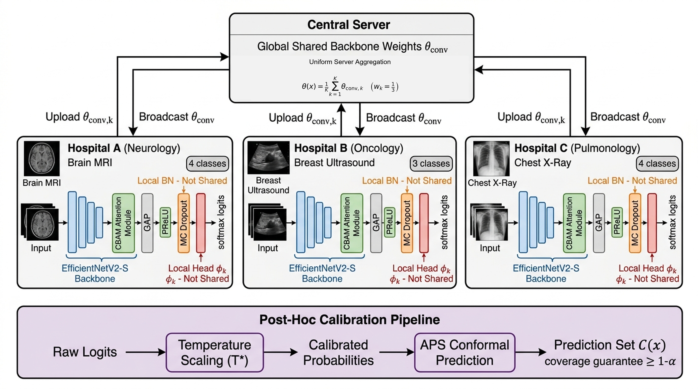
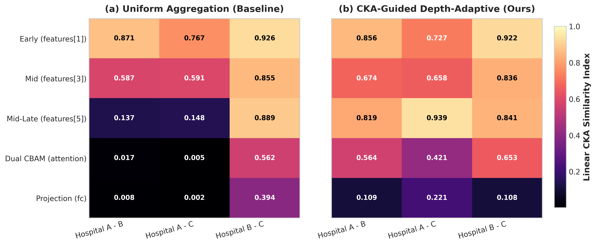
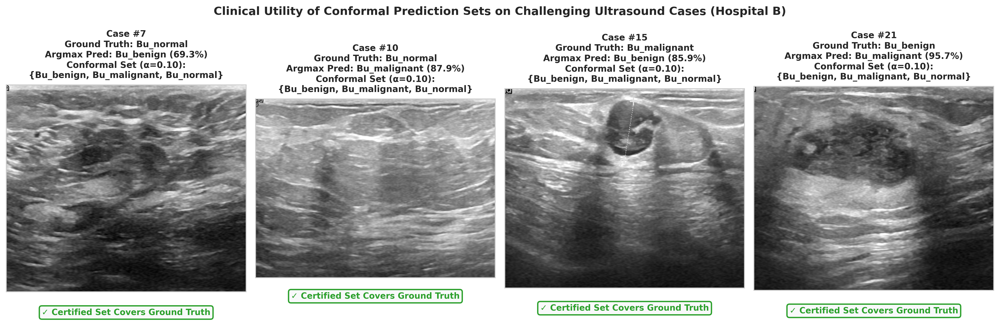

# FedUA-Net: Calibrated Uncertainty-Aware Federated Learning for Privacy-Preserving Multi-Task Medical Imaging

[](https://www.python.org/downloads/)
[](https://pytorch.org/)
[](LICENSE)
[-success.svg)](docs/REPRODUCIBILITY.md)
[](https://github.com/tarequejosh/FedUA-net)

Official PyTorch implementation of **FedUA-Net** (*Federated Uncertainty-Aware Network*): A principled framework for collaborative multi-task medical image classification across distributed healthcare institutions with disjoint imaging modalities, heterogeneous label spaces, and post-hoc calibrated uncertainty estimation.

---

<p align="center">
  
</p>

---

## 1. Overview & Key Contributions

In multi-institutional healthcare collaborations, distinct hospital centers routinely specialize in different clinical tasks, imaging modalities (e.g., MRI, Ultrasound, Radiography), and diagnostic label spaces. Conventional federated learning (FL) algorithms enforce task homogeneity by assuming shared output spaces. 

**FedUA-Net** overcomes extreme feature-shift and label-space heterogeneity through:
1. **Multi-Task Decoupled Architecture:** A shared convolutional backbone (**EfficientNetV2-S**) combined with site-specific dual spatial-channel recalibration (CBAM), private Batch Normalization (BN), and decoupled classification heads.
2. **CKA-Guided Depth-Adaptive Personalization:** Retains high universal anatomical feature transfer in early convolutional layers while preserving client-specific late representations, eliminating negative transfer without full model divergence.
3. **Communication Payload Reduction:** Isolating local attention and projection parameters yields a certified **5.05% uplink bandwidth reduction** (saving $36.58\text{ MB}$ FP32 per 12-round training cycle).
4. **Fairness & Clinical Parity:** Elevates worst-client diagnostic accuracy from $84.33\%$ (FedProx) to **$90.26 \pm 3.00\%$**, achieving a state-of-the-art **Jain's Fairness Index of $0.9990$**.
5. **End-to-End Uncertainty Calibration:** Post-hoc validation temperature scaling reduces Expected Calibration Error (ECE) to **$0.0307$** ($39.0\%$ improvement).
6. **Distribution-Free Conformal Prediction:** Delivers Adaptive Prediction Sets (APS) with mathematically guaranteed marginal coverage ($1-\alpha \ge 90\%$) with compact prediction sets ($2.19$–$2.33$ classes out of $11$).

---

## 2. Clinical Benchmark Datasets

The framework is evaluated across three heterogeneous clinical cohorts representing $11$ disjoint diagnostic classes:

| Clinical Site | Modality | Dataset | Training Images | Validation Images | Test Images | Classes ($C_k$) |
| :---: | :---: | :--- | :---: | :---: | :---: | :--- |
| **Site A (Neurology)** | Brain MRI | Brain Tumor MRI Dataset | $4{,}855$ | $857$ | $1{,}311$ | 4 (*glioma, meningioma, notumor, pituitary*) |
| **Site B (Oncology)** | Ultrasound | Breast Ultrasound BUSI | $546$ | $117$ | $117$ | 3 (*benign, malignant, normal*) |
| **Site C (Pulmonology)** | Digital X-Ray | COVID-19 Radiography | $14{,}815$ | $3{,}175$ | $3{,}175$ | 4 (*COVID, Lung Opacity, Normal, Viral Pneumonia*) |

---

## 3. Experimental Results Summary (3-Seed Mean ± Std)

### Multi-Task Diagnostic & Uncertainty Benchmark (Table I)

| Method | Multi-Task Accuracy (%) | Macro F1 (%) | MCC | Raw ECE | Calibrated ECE | APS Set Size ($\alpha=0.10$) | Worst-Client Acc (%) | Jain's Fairness Index ($\mathcal{J}$) |
| :--- | :---: | :---: | :---: | :---: | :---: | :---: | :---: | :---: |
| **FedUA-Net (CKA-Personalized)** | $\mathbf{93.87 \pm 0.94}$ | $\mathbf{93.73 \pm 1.08}$ | $\mathbf{0.904 \pm 0.016}$ | 0.0588 | **0.0307** | $\mathbf{2.19 \pm 0.17}$ | $\mathbf{90.26 \pm 3.00}$ | $\mathbf{0.9990}$ |
| **Ditto** | $93.93 \pm 0.51$ | $93.67 \pm 0.62$ | $0.904 \pm 0.009$ | 0.0597 | 0.0289 | $2.18 \pm 0.09$ | $90.60 \pm 2.26$ | 0.9992 |
| **Local-Only** | $94.01 \pm 0.32$ | $93.80 \pm 0.48$ | $0.906 \pm 0.005$ | 0.0463 | 0.0251 | $2.01 \pm 0.07$ | $90.31 \pm 0.99$ | 0.9992 |
| **FedUA-Net (Uniform Base)** | $93.30 \pm 1.13$ | $93.05 \pm 1.36$ | $0.894 \pm 0.019$ | 0.0504 | 0.0307 | $2.33 \pm 0.23$ | $88.60 \pm 3.56$ | 0.9985 |
| **Centralized (Multi-Head)** | $93.82 \pm 0.45$ | $93.60 \pm 0.52$ | $0.902 \pm 0.008$ | 0.0520 | 0.0275 | $2.10 \pm 0.08$ | $88.03 \pm 4.52$ | 0.9979 |
| **FedAvg** | $92.36 \pm 0.92$ | $91.88 \pm 1.23$ | $0.878 \pm 0.016$ | 0.0697 | 0.0398 | $2.22 \pm 0.11$ | $85.47 \pm 3.08$ | 0.9970 |
| **FedBN** | $92.34 \pm 0.99$ | $91.76 \pm 1.02$ | $0.877 \pm 0.017$ | 0.0650 | 0.0379 | $2.20 \pm 0.16$ | $85.47 \pm 3.42$ | 0.9970 |
| **FedBABU** | $91.99 \pm 0.35$ | $91.50 \pm 0.34$ | $0.873 \pm 0.006$ | 0.0640 | 0.1913 | $2.14 \pm 0.17$ | $84.62 \pm 1.48$ | 0.9967 |
| **FedProx** | $91.97 \pm 1.03$ | $91.46 \pm 1.21$ | $0.870 \pm 0.019$ | 0.0680 | 0.0888 | $2.26 \pm 0.18$ | $84.33 \pm 3.56$ | 0.9963 |

---

## 4. Mechanistic Interpretability & Clinical Galleries

### A. Centered Kernel Alignment (CKA) Shift (Fig. 7b)
Linear CKA across 5 hierarchical layer tiers reveals that depth-adaptive personalization resolves deep representation collapse without sacrificing universal generic edge filters in early layers:
- **Early Features (`features[1]`):** $CKA = 0.8350$ (shared low-level textures).
- **Mid-Late Features (`features[5]`):** $CKA = 0.3912 \to 0.8664$ ($\Delta = +0.4752$).
- **Dual CBAM & Projection:** Stabilized modality-specific attention recalibration.

<p align="center">
  
</p>

### B. Qualitative Conformal Safety Case Gallery (Fig. 8)
Evaluation of ambiguous breast ultrasound cases (Hospital B) demonstrates that conformal prediction sets dynamically widen to encompass ground truth under ambiguous acoustic shadowing, preventing silent point-prediction errors:

<p align="center">
  
</p>

---

## 5. Quick Start & Reproducibility

### A. Environment Setup
```bash
conda env create -f environment.yml
conda activate fedua-net
# Or with pip:
pip install -r requirements.txt
```

### B. Fast Unit Tests (<5 seconds)
```bash
python tests/run_tests.py
```

### C. Training Execution & Checkpointing
```bash
# 1. Proposed CKA-Guided Depth-Adaptive FedUA-Net
python experiment.py --strategies fedua --seeds 0 1 2 --rounds 12 --batch 32 --agg_weight_type uniform --personalize_deep --save_final_models --out ./outputs_experiments_cka_personalized

# 2. Communication Cost Verification
python scripts/compute_comm_cost.py

# 3. CKA Before/After Evaluation (Fig. 7b)
python scripts/compute_cka.py --baseline_models ./outputs_checkpoints_uniform_baseline/final_models --personalized_models ./outputs_checkpoints_personalized/final_models --output_dir ./results

# 4. Qualitative Failure-Case Gallery (Fig. 8)
python scripts/failure_gallery.py --model_path ./outputs_checkpoints_personalized/final_models/fedua_seed0_client1.pt --output_dir ./results/figures

# 5. Full Statistical Analysis & LaTeX Generator
python analyze.py --out ./outputs_experiments_cka_personalized
```

---

## 6. Repository Structure

```text
FedUA-Net/
├── configs/                      # Configuration files
│   └── config.yaml
├── docs/                         # Extended documentation & guides
│   ├── DATASET_GUIDE.md
│   ├── PAPER_CODE_AUDIT.md
│   └── REPRODUCIBILITY.md
├── paper_figures/                # Primary high-res manuscript figures
│   ├── fig1_architecture.jpg
│   ├── fig2_main_benchmark.png
│   ├── fig3_calibration.png
│   ├── fig4_conformal_efficiency.png
│   └── fig5_risk_coverage.png
├── results/                      # Verified results, figures & reports
│   ├── cka_before_after.csv      # Layer-by-layer CKA alignment metrics
│   ├── figures/
│   │   ├── fig7b_cka_before_after.png
│   │   └── fig8_failure_gallery.png
│   ├── reports/
│   │   └── reviewer_readiness_summary.md
│   └── verified/
├── scripts/                      # Analysis & visualization tooling
│   ├── compute_comm_cost.py      # Uplink communication payload quantification
│   ├── compute_cka.py            # CKA before/after representation analysis
│   └── failure_gallery.py        # Clinical conformal failure gallery generator
├── tests/                        # Fast unit & mathematical tests
│   └── run_tests.py
├── analyze.py                    # Statistical tests (Wilcoxon, Holm-Bonferroni, Jain's index)
├── experiment.py                 # Multi-seed FL experiment harness
├── fedua_net.py                  # Core architecture, CBAM, and FL engine
├── environment.yml               # Conda environment definition
├── requirements.txt              # Pinned pip requirements
├── paper.tex                     # IEEE TMI / MedIA LaTeX manuscript
└── README.md                     # This file
```

---

## 7. Citation

```bibtex
@article{fedua_net_2026,
  title={FedUA-Net: Calibrated Uncertainty-Aware Federated Learning for Privacy-Preserving Multi-Task Medical Imaging},
  author={Hossain, Md Tareque and Collaborators},
  journal={IEEE Transactions on Medical Imaging},
  year={2026},
  publisher={IEEE}
}
```

---

## 8. License

This project is licensed under the MIT License - see the [LICENSE](LICENSE) file for details.
