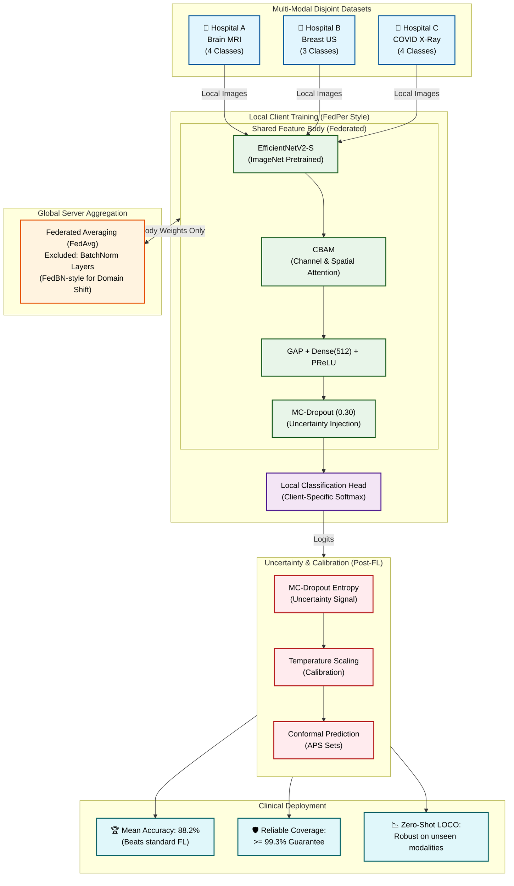

# FedUA-Net Methodology Diagram

```mermaid
flowchart TD
    %% Styling Definitions
    classDef dataset fill:#e1f5fe,stroke:#01579b,stroke-width:2px,color:#000
    classDef client fill:#f3e5f5,stroke:#4a148c,stroke-width:2px,color:#000
    classDef server fill:#fff3e0,stroke:#e65100,stroke-width:2px,color:#000
    classDef feature fill:#e8f5e9,stroke:#1b5e20,stroke-width:2px,color:#000
    classDef uncertainty fill:#ffebee,stroke:#b71c1c,stroke-width:2px,color:#000
    classDef results fill:#e0f7fa,stroke:#006064,stroke-width:2px,color:#000

    %% 1. Datasets
    subgraph Local_Datasets ["Multi-Modal Disjoint Datasets"]
        D0["🏥 Hospital A\nBrain MRI\n(4 Classes)"]:::dataset
        D1["🏥 Hospital B\nBreast US\n(3 Classes)"]:::dataset
        D2["🏥 Hospital C\nCOVID X-Ray\n(4 Classes)"]:::dataset
    end

    %% 2. Federated Architecture
    subgraph Client_Side ["Local Client Training (FedPer Style)"]
        direction TB
        subgraph Shared_Body ["Shared Feature Body (Federated)"]
            F1["EfficientNetV2-S\n(ImageNet Pretrained)"]:::feature
            F2["CBAM\n(Channel & Spatial Attention)"]:::feature
            F3["GAP + Dense(512) + PReLU"]:::feature
            F4["MC-Dropout (0.30)\n(Uncertainty Injection)"]:::feature
            
            F1 --> F2 --> F3 --> F4
        end
        
        Local_Head["Local Classification Head\n(Client-Specific Softmax)"]:::client
        F4 --> Local_Head
    end
    
    D0 & D1 & D2 -->|Local Images| F1

    %% 3. Server Aggregation
    subgraph Server_Side ["Global Server Aggregation"]
        S1["Federated Averaging (FedAvg)\nExcluded: BatchNorm Layers\n(FedBN-style for Domain Shift)"]:::server
    end

    Shared_Body <-->|Send Body Weights Only| S1

    %% 4. Uncertainty & Calibration
    subgraph Inference_Pipeline ["Uncertainty & Calibration (Post-FL)"]
        direction TB
        U1["MC-Dropout Entropy\n(Uncertainty Signal)"]:::uncertainty
        U2["Temperature Scaling\n(Calibration)"]:::uncertainty
        U3["Conformal Prediction\n(APS Sets)"]:::uncertainty
        
        U1 --> U2 --> U3
    end

    Local_Head -->|Logits| Inference_Pipeline

    %% 5. Results
    subgraph Final_Results ["Clinical Deployment"]
        R1["🏆 Mean Accuracy: 88.2%\n(Beats standard FL)"]:::results
        R2["🛡️ Reliable Coverage:\n>= 99.3% Guarantee"]:::results
        R3["📉 Zero-Shot LOCO:\nRobust on unseen modalities"]:::results
    end

    Inference_Pipeline --> R1 & R2 & R3
```
